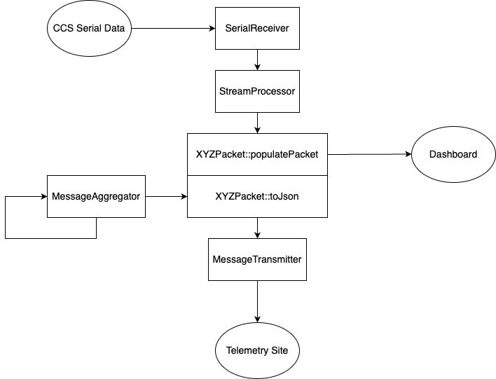
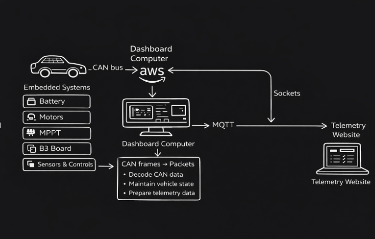

# Helios Mercury — Interface Systems

## Quick Links

- [Interface Systems Overview](./docs/InterfaceSystems.md)
- [New Recruit Machine Setup](./docs/MachineSetupGuide.md)
- [Virtual Machine Setup](./docs/VMSetupGuide.md)
- [CAN Setup Guide](./docs/CanSetupGuide.md)
- [Workflow Guide](./docs/Workflow.md)
- [Linux / Raspberry Pi Guide](./docs/LinuxCommandGuide.md)
- [Interface Systems Projects](./docs/Projects.md)

## Architecture

