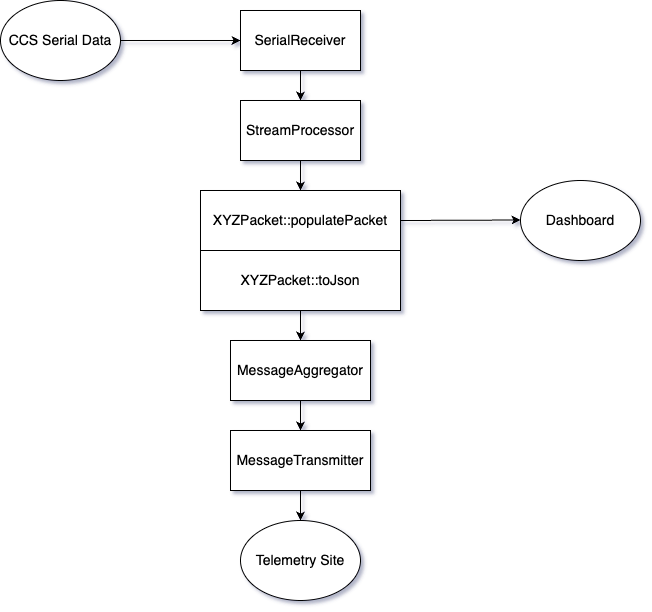

# Helios-Mercury

#### Qt Version
- Qt 6.7.2

### Building From Terminal
In a terminal, navigate to the Helios-Mercury repository. Run the following commands:

#### Step 1
`mkdir build`

`cd build`

#### Step 2
For Linux:

`path/to/Qt/6.7.2/gcc_64/bin/qt-cmake ..`

For Mac:

`path/to/Qt/6.7.2/macos/bin/qt-cmake ..`

#### Step 3
`make`

## Architecture Diagram

